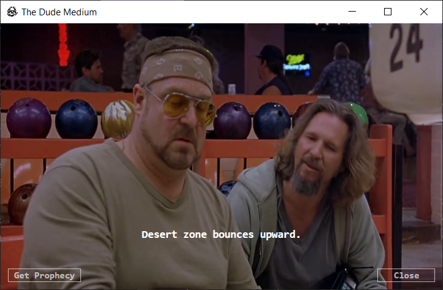

<div id="top"></div>
<!--
*** Thanks for checking out the Best-README-Template. If you have a suggestion
*** that would make this better, please fork the repo and create a pull request
*** or simply open an issue with the tag "enhancement".
*** Don't forget to give the project a star!
*** Thanks again! Now go create something AMAZING! :D
-->

<!-- PROJECT SHIELDS -->
<!--
*** I'm using markdown "reference style" links for readability.
*** Reference links are enclosed in brackets [ ] instead of parentheses ( ).
*** See the bottom of this document for the declaration of the reference variables
*** for contributors-url, forks-url, etc. This is an optional, concise syntax you may use.
*** https://www.markdownguide.org/basic-syntax/#reference-style-links
-->

<!-- PROJECT LOGO -->
<br />
<div align="center">
  <a href="https://github.com/Snailware/TheDudeMedium">
    
  </a>

  <h3 align="center">The Dude Medium</h3>

  <p align="center">
    Get prophecies and visions from The Dude himself.
    <br />
    <a href="https://github.com/Snailware/TheDudeMedium"><strong>Explore the docs »</strong></a>
    <br />
    <br />
    <a href="https://github.com/Snailware/TheDudeMedium/issues">Report Bug</a>
    ·
    <a href="https://github.com/Snailware/TheDudeMedium/issues">Request Feature</a>
  </p>
</div>

<!-- TABLE OF CONTENTS -->
<details>
  <summary>Table of Contents</summary>
  <ol>
    <li>
      <a href="#about-the-project">About The Project</a>
      <ul>
        <li><a href="#built-with">Built With</a></li>
      </ul>
    </li>
    <li>
      <a href="#getting-started">Getting Started</a>
      <ul>
        <li><a href="#prerequisites">Prerequisites</a></li>
        <li><a href="#installation">Installation</a></li>
      </ul>
    </li>
    <li><a href="#usage">Usage</a></li>
    <li><a href="#roadmap">Roadmap</a></li>
    <li><a href="#contributing">Contributing</a></li>
    <li><a href="#license">License</a></li>
    <li><a href="#contact">Contact</a></li>
    <li><a href="#acknowledgments">Acknowledgments</a></li>
  </ol>
</details>

<!-- ABOUT THE PROJECT -->

## About The Project

<div align="center">
  <a href="https://github.com/Snailware/TheDudeMedium">
    
  </a>
</div>
</br>

<p align="left">This program will randomly generate prophecies and visions from The Dude, the main character from <a href="https://www.imdb.com/title/tt0118715/">The Big Lebowski</a>.</p>

<p align="right">(<a href="#top">back to top</a>)</p>

### Built With

-   [.NET Framework](https://dotnet.microsoft.com/en-us/download/dotnet-framework)
-   [Windows Presentation Foundation](https://docs.microsoft.com/en-us/visualstudio/designers/getting-started-with-wpf?view=vs-2019)
-   [SQLite](https://www.sqlite.org/index.html)

<p align="right">(<a href="#top">back to top</a>)</p>

<!-- GETTING STARTED -->

## Getting Started

### Prerequisites

-   [Windows 10](https://www.microsoft.com/en-us/software-download/windows10)
-   [Visual Studio](https://visualstudio.microsoft.com/vs/community/)

### Installation

1.  [Download ZIP](https://github.com/Snailware/TheDudeMedium/archive/refs/heads/master.zip) and extract contents, **or** clone the repo:

    ```sh
    git clone https://github.com/Snailware/TheDudeMedium.git
    ```

2.  Open the Solution using [Visual Studio](https://visualstudio.microsoft.com/vs/community/).

3.  Build solution as desired.

<p align="right">(<a href="#top">back to top</a>)</p>

<!-- USAGE EXAMPLES -->

## Usage

Start the program and click the `Get Prophecy` button in the bottom left corner to get a prophecy. Repeat as desired. Click the `Close` button in the bottom right corner when finished to close the program.

<p align="right">(<a href="#top">back to top</a>)</p>

<!-- ROADMAP -->

## Roadmap

See the [open issues](https://github.com/Snailware/TheDudeMedium/issues) for a full list of proposed features (and known issues).

<p align="right">(<a href="#top">back to top</a>)</p>

<!-- CONTRIBUTING -->

## Contributing

Contributions are what make the open source community such an amazing place to learn, inspire, and create. Any contributions you make are **greatly appreciated**.

If you have a suggestion that would make this better, please fork the repo and create a pull request. You can also simply open an issue with the tag "enhancement".
Don't forget to give the project a star! Thanks again!

1. Fork the Project
2. Create your Feature Branch (`git checkout -b feature/AmazingFeature`)
3. Commit your Changes (`git commit -m 'Add some AmazingFeature'`)
4. Push to the Branch (`git push origin feature/AmazingFeature`)
5. Open a Pull Request

<p align="right">(<a href="#top">back to top</a>)</p>

<!-- LICENSE -->

## License

Distributed under the GNU-3.0 License. See [LICENSE](https://github.com/Snailware/TheDudeMedium/blob/master/LICENSE) for more information.

<p align="right">(<a href="#top">back to top</a>)</p>

<!-- CONTACT -->

## Contact

<!--Your Name - [@twitter_handle](https://twitter.com/twitter_handle) - email@email_client.com -->

Project Link: [https://github.com/Snailware/TheDudeMedium](https://github.com/Snailware/TheDudeMedium)

<p align="right">(<a href="#top">back to top</a>)</p>

<!-- ACKNOWLEDGMENTS -->

## Acknowledgments

-   [Terry Davis](https://en.wikipedia.org/wiki/Terry_A._Davis) - This program is loosely based on the oracle program in [TempleOS](https://templeos.org/). _Rest in peace, Terry._
-   [Adam Ralph](https://github.com/adamralph) - `icon.png` copied from [adamralph/dude](https://github.com/adamralph/dude).
-   [Othneil Drew](https://github.com/othneildrew) - `README.md` created using [Best-README-Template](https://github.com/othneildrew/Best-README-Template).

<p align="right">(<a href="#top">back to top</a>)</p>

<!-- MARKDOWN LINKS & IMAGES -->
<!-- https://www.markdownguide.org/basic-syntax/#reference-style-links -->
<!--
[contributors-url]: https://github.com/Snailware/TheDudeMedium/graphs/contributors
[forks-url]: https://github.com/Snailware/TheDudeMedium/network/members
[stars-url]: https://github.com/Snailware/TheDudeMedium/stargazers
[issues-url]: https://github.com/Snailware/TheDudeMedium/issues
[license-url]: https://github.com/Snailware/TheDudeMedium/blob/master/LICENSE
-->
